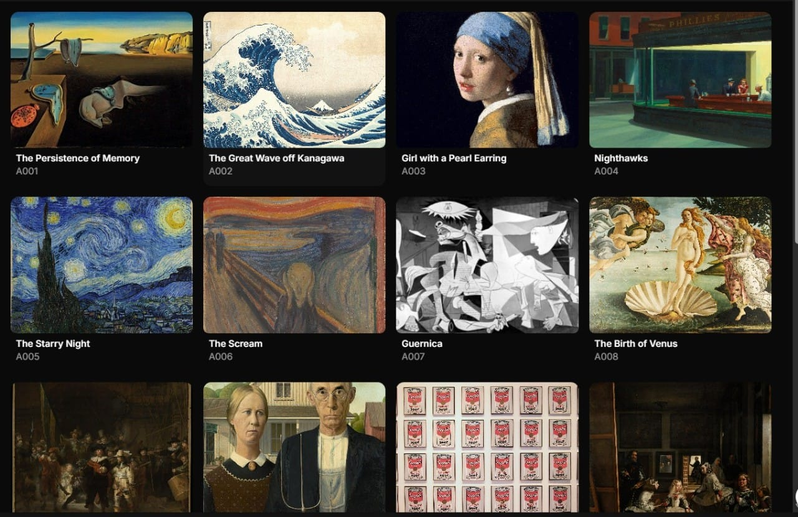
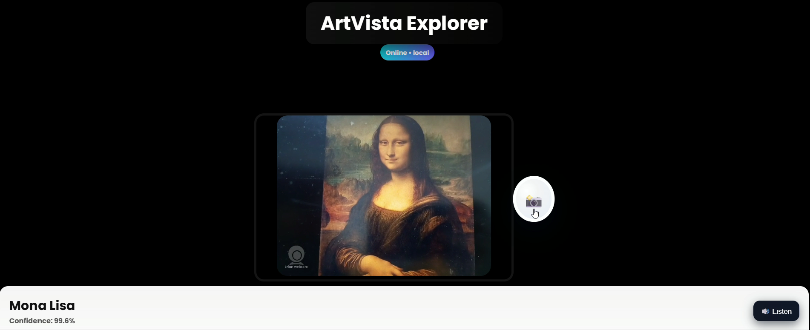
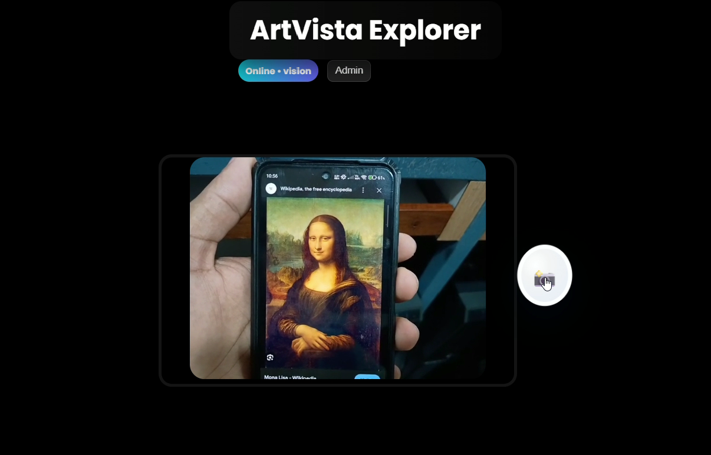

# Art-Vista-Explorer
ArtVista Explorer addresses the RealMeta challenge: "How might we enable museum visitors to instantly access rich, contextual information about a painting by scanning it (image recognition), with no login barrier, while giving the institution meaningful, privacy-conscious visitor analytics?"

# Context
Museums and galleries have vast collections of culturally significant works, yet physical labels offer limited, static information. Audio guides and AR/VR apps exist, but often require registration or extra hardware, adding friction. Visitors desire immediate insights—simply point a phone, scan, and learn—without onboarding hassles. At the same time, institutions seek engagement data but often don’t require full user accounts due to privacy considerations. This creates a gap for seamless, no-login digital interactions that still support anonymized analytics.

# Solution
ArtVista Explorer is a Progressive Web App that bridges this gap:

Instant Image Recognition:
Visitors scan paintings using device camera or upload an image for instant identification.

Rich Contextual Data:
The app displays artist bios, technique details, provenance, style notes, related works, and multimedia—far beyond what physical labels allow.

Seamless Experience:
No login, registration, or special hardware needed. Runs directly in any browser with fast, responsive UI .

Online & Offline AI:
Uses Google Vision API for high-accuracy recognition when online; falls back to a custom-trained TensorFlow.js model for offline operation, ensuring uninterrupted service.

Audio Narration:
Web Speech Synthesis API reads out exhibit descriptions for accessibility.

Privacy-Conscious Analytics:
Anonymous logging of artwork views and interactions helps institutions understand engagement—all data is aggregated, with no personal tracking.

# Unique Features & Innovation
Hybrid AI Recognition:
Online API integration plus offline browser AI (TensorFlow.js) for reliability and speed.

No Login Required
Maximizes accessibility and reduces visitor friction.

Modern PWA Technology:
Works offline, installable, and fast (Vite + React + Tailwind CSS).

Responsive Multimedia Display:
Easy-to-read formats—image, text, audio, video—all contextualized below the captured artwork.

Institution Analytics:
Dashboard for aggregate, privacy-respecting visitor analytics.

# How It Works
Capture/Upload: User captures or uploads painting images.

Recognition:

If online, image is sent to backend /api/recognize for Google Vision API analysis.

If offline, local TensorFlow.js model predicts artwork.

Display: Results shown with description, multimedia, and audio narration.

Works Offline: Thanks to PWA caching and service workers.

# Future Scope
Multilingual Support:
Automatic translation and narration for diverse audiences.

Adaptive Recommendations:
AI-powered content suggestions to enhance visitor journey.

Integration with AR:
Fusion with AR overlays and museum navigation aids.

Expanded Analytics:
Time-based engagement, heatmaps, and trend tracking—still privacy-first.

Dataset Enrichment:
Larger training sets from open museum collections, supporting global scalability.

# Contributors
Vishnu Prasad – Developed the core TensorFlow model training and contributed to backend API implementation with basic server functionality.

Vineeth – Led complete frontend development, including UI creation, integration of APIs, and backend support for seamless communication.

Shrikari Bhat – Responsible for dataset preparation, AI model design, and overall AI integration within the system.

Sarthak – Assisted with testing, quality assurance, and supported coordination to ensure smooth team collaboration.
